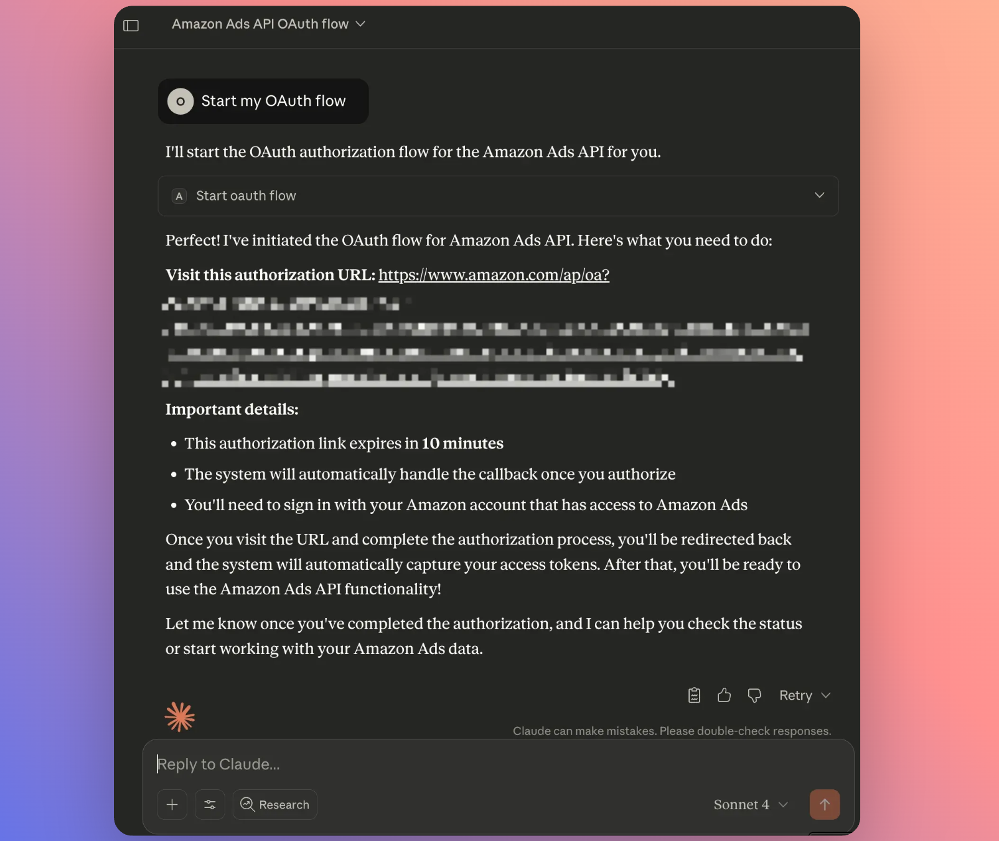
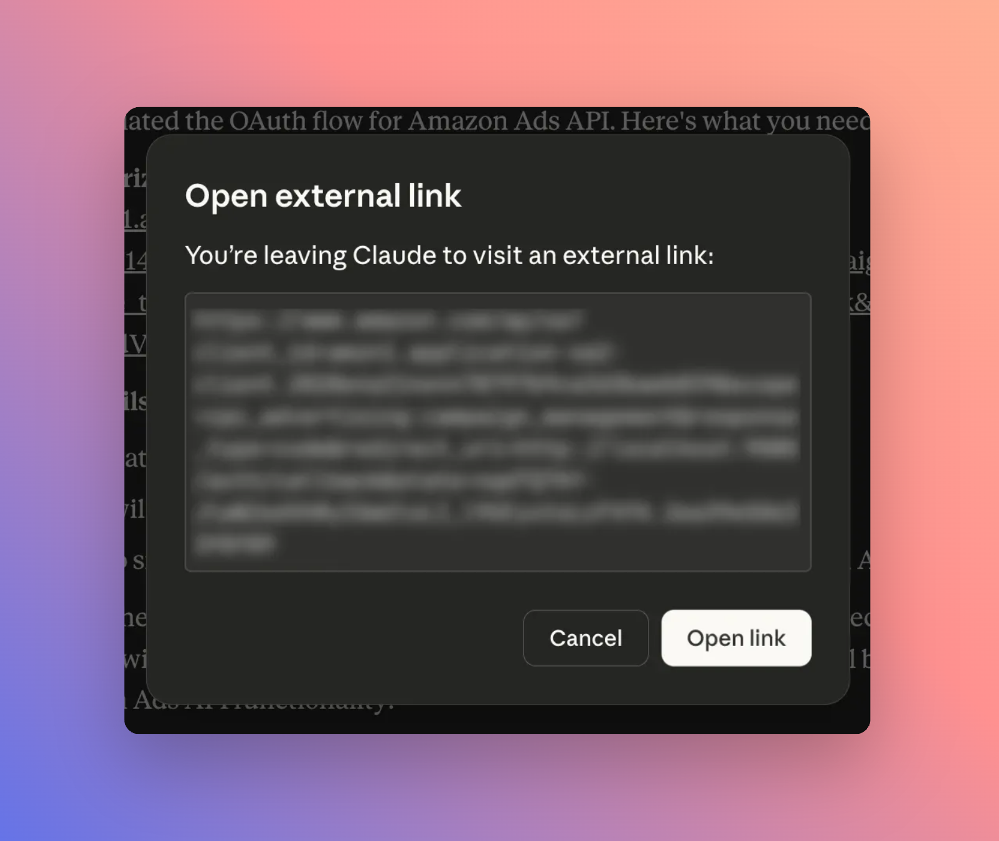
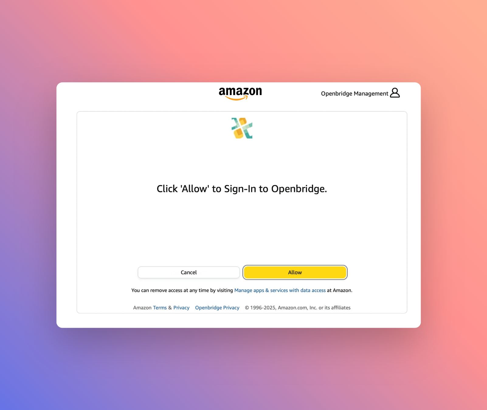
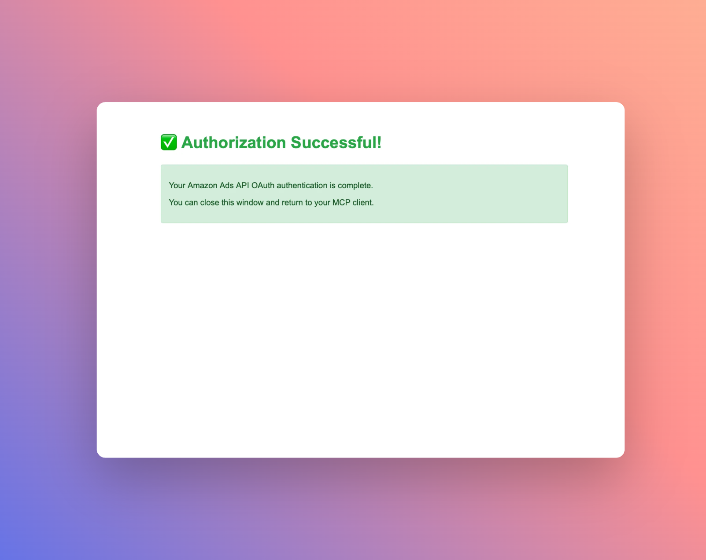
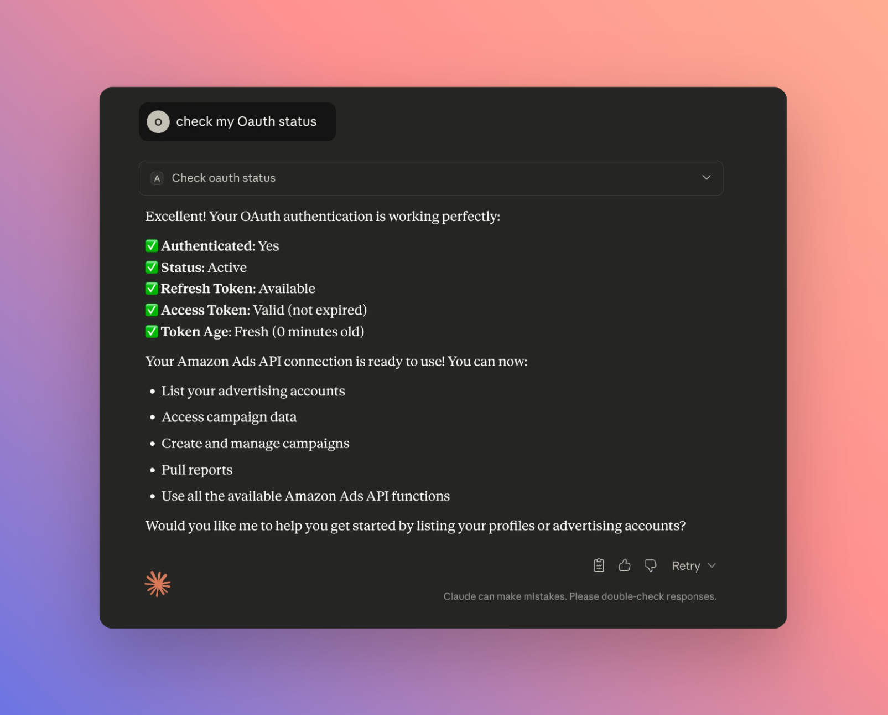

<div align="center">

# Amazon Ads API MCP SDK

**Build AI-powered advertising applications with the Model Context Protocol (MCP) SDK for Amazon Advertising API**

*Made with ❤️ + ☕ by [Openbridge](https://www.openbridge.com/)*

[](https://www.python.org/downloads/)
[](https://opensource.org/licenses/MIT)


</div>

## What Are MCP Tools?
Think of MCP (Model Context Protocol) as a translator between an AI model and outside systems (like Amazon Ads). Each MCP tool is like a remote control button that tells the AI how to interact with Amazon Ads. Without MCP tools, the AI would have no idea how to “talk” to Amazon Ads.

With MCP tools:
* The AI knows the exact endpoints to call.
* The AI can request campaign reports, budgets, or targeting data safely.
* Everything is structured, so the AI doesn’t break things by making random guesses.

👉 In short: MCP tools = a safe, well-labeled toolkit that lets AI work with the [Amazon Ads API](https://advertising.amazon.com/API/docs/en-us).

## 🚀 What is Amazon Ads API MCP SDK?

The Amazon Ads API MCP SDK is an open-source implementation that provides a robust foundation for creating AI-powered advertising tools, chatbots, and automated services.

### ✨ Key Features

- **🔌 MCP Integration**: Full Model Context Protocol compliance for AI application integration
- **🌍 Multi-Region Support**: NA, EU, and FE region endpoints with automatic routing
- **📊 Comprehensive API Coverage**: Campaigns, profiles, reporting, DSP, AMC workflows, and more
- **📝 Type Safety**: Full Pydantic model support with comprehensive type hints
- **🧪 Production Ready**: Includes testing, validation, and error handling

## 🎯 Use Cases

### Claude Desktop Integration
- **Campaign Management**: Ask Claude to create, update, or analyze campaigns
- **Performance Insights**: Get AI-powered analysis of your advertising performance
- **Budget Optimization**: Let Claude suggest budget adjustments based on performance
- **Creative Testing**: Get recommendations for ad creative improvements
- **Reporting**: Generate custom reports and insights on demand

### AI Applications
- **Marketing Chatbots**: Build conversational AI that can manage Amazon Ads campaigns
- **Automated Reporting**: AI-powered insights and performance analysis
- **Smart Budget Management**: Intelligent budget optimization using AI
- **Creative Optimization**: AI-driven ad creative testing and optimization

### Enterprise Services
- **Marketing Automation Platforms**: Integrate Amazon Ads into existing marketing tools
- **Agency Management Systems**: Multi-client, multi-account advertising management
- **E-commerce Integrations**: Connect Amazon Ads with e-commerce platforms
- **Analytics Dashboards**: Real-time advertising performance monitoring

### Developer Tools
- **API Wrappers**: Create custom SDKs for specific use cases
- **Testing Frameworks**: Automated testing for Amazon Ads integrations
- **Development Tools**: Local development and debugging utilities

## 📚 What Is Included In the Amazon Ads MCP?
There is broad coverage in the MCP server for the published in the Amazon Ads API. Each aligns with a collection of operations within the Amazon Ads API. This includes services like the new [Campaign Management services in the new Amazon Ads API v1](https://advertising.amazon.com/API/docs/en-us/guides/campaign-management/overview), [Exports](https://advertising.amazon.com/API/docs/en-us/guides/exports/overview), [Amazon Marketing Cloud](https://advertising.amazon.com/API/docs/en-us/guides/amazon-marketing-cloud/overview) and many more.

Here is a representative list of the various Amazon API services in the MCP:

- Accounts
- Audiences
- Reporting
- Brand metrics
- Sponsored Products
- Sponsored Brands
- Sponsored Display
- Amazon DSP
- Amazon Attribution
- Recommendations & insights
- Creatives
- Change history
- Data provider
- Products
- Unified pre-moderation
- Moderation
- Amazon Marketing Stream
- Locations
- Exports
- Media Planning
- Amazon Ads API v1 (Beta)

### 🧪 Amazon Ads API v1 (Beta)

The Amazon Ads API v1 represents a reimagined approach to the Amazon Ads API, built from the ground up to provide a seamless experience across all Amazon advertising products through a common model. One major benefit of this common model is improved compatibility with code generation tools such as client library generators.

> **⚠️ Beta Notice**: These APIs are currently in beta at Amazon. Features and endpoints may change. Use in production with caution.

| Package Name | Description | Prefix |
|-------------|-------------|--------|
| `ads-api-v1-sp` | Sponsored Products v1 | `spv1_` |
| `ads-api-v1-sb` | Sponsored Brands v1 | `sbv1_` |
| `ads-api-v1-dsp` | Amazon DSP v1 | `dspv1_` |
| `ads-api-v1-sd` | Sponsored Display v1 | `sdv1_` |
| `ads-api-v1-st` | Sponsored Television v1 | `stv1_` |

To activate Ads API v1 packages, add them to your `AMAZON_AD_API_PACKAGES` environment variable:

```bash
# Example: Enable Sponsored Products v1 and DSP v1
AMAZON_AD_API_PACKAGES="profiles,ads-api-v1-sp,ads-api-v1-dsp"
```

For more information, see Amazon's [Campaign Management Overview](https://advertising.amazon.com/API/docs/en-us/guides/campaign-management/overview).

## Installation

We recommend installing Amazon Ads API MCP with 🐳 [Docker](https://docs.astral.sh/uv/):

```bash
docker pull openbridge/amazon-ads-mcp
```

 Copy the environment template
 ```bash
cp .env.example .env
```

Edit .env with your settings

Start the server with Docker Compose
```bash
docker-compose up -d
```
The server will be available at http://localhost:9080

Check logs
```bash
docker-compose logs -f
```
Stop the server
```bash
docker-compose down
```

For full installation instructions, including verification, upgrading, and developer setup, see the [**Installation Guide**](INSTALL.md).

## Configuration
Amazon Ads requires that all calls to the API are authorized. If you are not sure what this means, you should read the Amazon docs:

* Amazon Ads API onboarding overview: https://advertising.amazon.com/API/docs/en-us/guides/onboarding/overview
* Getting started with the Amazon Ads API: https://advertising.amazon.com/API/docs/en-us/guides/get-started/overview

There are two paths for connecting to the API;
1. Bring Your Own App (BYOA)
2. Leverage Partner Apps

## Bring Your Own Amazon Ads API App
If you have your own Amazon Ads API app, or want to create one, the process is detailed below.

### 1. Register Your Application with Amazon

1. Go to the [Amazon Developer Console](https://developer.amazon.com/)
2. Create or select your Login with Amazon application
3. Note your `Client ID` and `Client Secret`
4. Set your callback URL to "Allowed Return URLs". This is where you are running this server:
   - For production: `https://your-server.com/auth/callback`
   - For local development: `http://localhost:8000/auth/callback`

Once you have your app secured and approved by Amazon, you will need the client ID and secret:
```bash
# Amazon Ads API Credentials (required)
AMAZON_AD_API_CLIENT_ID="your-client-id"
AMAZON_AD_API_CLIENT_SECRET="your-client-secret"
```
Make sure these are in your `.env` file. Also, make sure you set your authorization method to `direct` in the same `.env`:

```bash
AUTH_METHOD=direct
```

### Complete OAuth Flow
To authorize your connection to Amazon, you need to complete an OAuth workflow as an end user. First, you need to set your region. Authorization occurs at the region level and not setting your region may cause a failure. The server will default to the `na` region. You can manually set the region with tool `set_active_region`.

* Tool: `set_active_region`
* Parameters: `na` | `eu` | `fe`

Example prompt: *"Set my current region to `eu`"*

### Step 1: Start OAuth 

To connect to Amazon Ads API, you use an MCP tool to start your OAuth flow
* Tool: `start_oauth_flow`
* Example prompt: *"Start my OAuth flow"*



### Step 2: Redirect to Amazon Ads

In this example, you are prompted to click the link that will open a browser window and request approval at Amazon.



### Step 3: Approve Request

In the browser window, Amazon will prompt that you approve the request to connect.



### Step 4: Success

If all goes well, you will see a success response. You can close the browser window and go back to your client. If you see something else, attempt the process again and confirm all your configuration elements are correct




### Step 5: Confirmation

To confirm that your MCP server is connected to the Amazon Ads API, check your OAuth status

* Tool: `check_oauth_status`
* Example prompt: *"Check my OAuth status"*



You are ready to start interacting with the Amazon Ads API system!

### Partner Applications: Token Authentication
You can configure your client, like Claude, to use authentication by supplying a valid access token. This is most appropriate for service accounts, long-lived API keys, CI/CD, applications where authentication is managed separately, or other non-interactive authentication methods.

#### Openbridge Partner App
As an Ads API Partner application provider, Openbridge offers a ready-to-go gateway to the Amazon Ads API. You log into your Openbridge account, provision a token, then set your token in your client config (see below).

First, set Openbridge as the auth method:

```bash
AUTH_METHOD=openbridge
```

That is it for the server config. To access the server, you need configure the client, like Claude Desktop, to pass the token directly. (see [Example MCP Client: Connect Claude Desktop](#example-mcp-client-connect-claude-desktop))

##### Authorized Amazon Accounts

Your Amazon authorizations reside in Openbridge. Your first step in your client is to request your current identities: `"List my remote identities"`. Next, you would tell the MCP server to use one of these identities: `"Set my remote identity to <>"`. You can then ask the MCP to `List all of my Amazon Ad profiles` linked to that account. If you do not see an advertiser listed, set a different identity.


### Set Your Amazon Ads MCP Packages 
To activate, you need to set a comma-separated package to load. For example, to activate `profiles` and `amc-workflow`, set your package environment like this:
  - `AMAZON_AD_API_PACKAGES="profiles,amc-workflow"`

Here is the list of tool packages available in the server:

- `profiles`
- `campaign-manage`
- `accounts-manager-accounts`
- `accounts-ads-accounts`
- `accounts-portfolios`
- `accounts-billing`
- `accounts-account-budgets`
- `audiences-discovery`
- `reporting-version-3`
- `brand-benchmarks`
- `brand-metrics`
- `stores-analytics`
- `sponsored-products`
- `sp-suggested-keywords`
- `sponsored-brands-v4`
- `sponsored-brands-v3`
- `sponsored-display`
- `dsp-measurement`
- `dsp-advertisers`
- `dsp-audiences`
- `dsp-conversions`
- `dsp-target-kpi-recommendations`
- `amazon-attribution`
- `audience-insights`
- `forecasts`
- `brand-store-manangement`
- `partner-opportunities`
- `tactical-recommendations`
- `persona-builder`
- `creative-assets`
- `change-history`
- `data-provider-data`
- `data-provider-hashed`
- `products-metadata`
- `products-eligibility`
- `unified-pre-moderation-results`
- `moderation-results`
- `amazon-marketing-stream`
- `locations`
- `exports-snapshots`
- `marketing-mix-modeling`
- `reach-forecasting`
- `amc-administration`
- `amc-workflow`
- `amc-rule-audience`
- `amc-ad-audience`
- `ads-api-v1-sp` *(Beta)*
- `ads-api-v1-sb` *(Beta)*
- `ads-api-v1-dsp` *(Beta)*
- `ads-api-v1-sd` *(Beta)*
- `ads-api-v1-st` *(Beta)*

You will note that some are broken up into smaller groupings. For example, Amazon Marketing Cloud has bundles; `amc-ad-audience`, `amc-administration`, `amc-rule-audience`, and `amc-workflow`. This is done to create efficiencies and optimizations that reduce context limits in many AI clients. 

## Understanding Amazon Ads MCP Tools 

Amazon Ads MCP tools have prefixes (like `cp_` for Campaign Performance or `amc_` for Amazon Marketing Cloud) to help organize the specific Ads API operation.

Example prefixes:
- `cp_` → campaign/advertising APIs
- `amc_` → AMC-related APIs
- `dsp_` → DSP APIs
- `sd_` → Sponsored Display
- `ams_` → Amazon Marketing Stream
- `spv1_` → Sponsored Products v1 *(Beta)*
- `sbv1_` → Sponsored Brands v1 *(Beta)*
- `dspv1_` → Amazon DSP v1 *(Beta)*
- `sdv1_` → Sponsored Display v1 *(Beta)*
- `stv1_` → Sponsored Television v1 *(Beta)*  

This will translate into collections of tools that align with the API operations that are available:

**Campaign Management (`cp_`)**
- `cp_listCampaigns` — List all campaigns  
- `cp_getCampaign` — Get specific campaign  
- `cp_createCampaign` — Create new campaign  
- `cp_updateCampaign` — Update campaign  
- `cp_archiveCampaign` — Archive campaign  

**Sponsored Products (`sp_`)**
- `sp_listProductAds` — List product ads  
- `sp_createKeywords` — Create keywords  
- `sp_updateBids` — Update keyword bids  
- `sp_getNegativeKeywords` — Get negative keywords  

**AMC Workflows (`amc_`)**
- `amc_listWorkflows` — List AMC workflows  
- `amc_executeWorkflow` — Run workflow  
- `amc_getWorkflowStatus` — Check workflow status  

Users would see tools like:

- **"List my Amazon Ads campaigns"**  
  → Claude uses: `cp_listCampaigns`

- **"Create an AMC workflow"**  
  → Claude uses: `amc_createWorkflow`

- **"Export my sponsored products ads data"**  
  → Claude uses: `export_createAdExport`

## Advertiser Profiles & Regions

### Setting Your Advertiser Profile 
Per Amazon: *Profiles play a crucial role in the Amazon Ads API by determining the management scope for a given call. A profile ID is a required credential to access an advertiser's data and services in a specific marketplace.*

You may not know what profile(s) authorization grants you access to. You can list all advertising profiles accessible by your authorization:

* Tool: `ac_listProfiles`
* Example prompt: *"List my advertiser profile ids"*

Response includes profile details:
- profileId, countryCode, currencyCode
- dailyBudget, timezone
- accountInfo (type: seller/vendor/agency)

Let's assume your list included profile ID `1043817530956285`. You can check for more details by getting profile details to confirm this is the one you want to use.

* Tool: `ac_getProfile`    
* Example prompt: *"Get the details for my profile_id: `1043817530956285`"*

Assuming this is the profile you want to use, you need to **set** the profile Amazon requires for API calls:
* Tool: `set_active_profile`
* Example prompt: *"Set my active profile id to `1043817530956285`"*

When you set the profile, it determines:
- Which account's data you access
- Currency and timezone for reports
- Available campaigns/ads/keywords

The profile ID will be set in the background for the duration of your session. Repeat the process if you want to switch to a new profile.

Most calls to the Amazon Ads API require a Region. Each [advertiser profile ID](https://advertising.amazon.com/API/docs/en-us/guides/account-management/authorization/profiles) is associated with an advertising account in a specific region/marketplace. 

The region is part of an advertiser profile. When you set an advertiser profile with `set_active_profile`, it will set the region that is associated with the profile automatically.

* Tool: `set_active_profile`

Example prompt: *"Set my active advertiser profile to `111111111111`"* 

Since profile ID `111111111111` is based in `na`, the region will be set based on the profile region.

### Set Active Region
The Amazon Ads MCP server includes tools for managing API regions as defaults and dynamically, allowing you to switch between North America (`na`), Europe (`eu`), and Far East (`fe`) regions without restarting the server.

| Region Code | Name | API Endpoint 
|------------|------|--------------|
| `na` | North America | https://advertising-api.amazon.com
| `eu` | Europe | https://advertising-api-eu.amazon.com
| `fe` | Far East | https://advertising-api-fe.amazon.com 

When you set a region, the system automatically:

1. **Updates API endpoints** - Routes API calls to the correct regional endpoint
2. **Updates OAuth endpoints** - Uses the correct token refresh endpoint for the region
3. **Clears cached tokens** - Ensures fresh authentication for the new region
4. **Preserves other settings** - Keeps profile ID and identity settings intact


**IMPORTANT: Avoid Region Mismatch**: *If you attempt to set a region that is not associated with your advertiser profile, the Ads API will reject your requests. For example, if a profile ID is attached to `na` and you manually set the region to `eu`, you have created a mismatch which will cause API request failures.*

### Get Active Region
If you are not sure what region is set, you can check for the region
* Tool: `get_active_region`
* Returns: Current region, endpoints, and configuration source

Example prompt: *"What is my current active region?"*

## Example MCP Client: Connect Claude Desktop

Navigate to Connector Settings

Open Claude in your browser and navigate to the settings page. You can access this by clicking on your profile icon and selecting “Settings” from the dropdown menu. Once in settings, locate and click on the “Connectors” section in the sidebar. This will display your currently configured connectors and provide options to add new ones.

Edit your Claude Desktop configuration file:

**macOS**: `~/Library/Application Support/Claude/claude_desktop_config.json`  
**Windows**: `%APPDATA%\Claude\claude_desktop_config.json`  
**Linux**: `~/.config/Claude/claude_desktop_config.json`

In this example, we show how to use the bearer token using the Openbridge API key. Add this configuration to your `mcpServers` section:

```json
{
  "mcpServers": {
    "amazon_ads_mcp": {
      "command": "npx",
      "args": [
        "-y",
        "mcp-remote@latest",
        "http://${HOSTNAME}:${PORT}/mcp/",
        "--allow-http",
        "--header",
        "Authorization:Bearer ${OPENBRIDGE_API_KEY}",
        "--header",
        "Accept:application/json,text/event-stream",
        "--debug"
      ],
      "env": {
        "MCP_TIMEOUT": "300",
        "HOSTNAME": "your_hostname",
        "PORT": "your_server_port",
        "MCP_TIMEOUT": "120000",
        "MCP_REQUEST_TIMEOUT": "60000",
        "MCP_CONNECTION_TIMEOUT": "10000",
        "MCP_SERVER_REQUEST_TIMEOUT": "60000",
        "MCP_TOOL_TIMEOUT": "120000",
        "MCP_REQUEST_WARNING_THRESHOLD": "10000",
        "OPENBRIDGE_API_KEY": "your_openbridge_token_here"
      }
    }
  }
}
```
**Note**: Replace `hostname`, `port` and `your_openbridge_token_here` with your actual OpenBridge token.

**IMPORTANT**: Cursor and Claude Desktop (Windows) have a bug where spaces inside args aren't escaped when it invokes npx, which ends up mangling these values. You can work around it using: [mcp-remote custom headers documentation](https://github.com/geelen/mcp-remote?tab=readme-ov-file#custom-headers). 

The config would look something like this:


```json
{
  "mcpServers": {
    "amazon_ads_mcp": {
      "command": "npx",
      "args": [
        "-y",
        "mcp-remote",
        "http://${HOSTNAME}:${PORT}/mcp/",
        "--allow-http",
        "--header",
        "Authorization:${AUTH_HEADER}"
        "--header",
        "Accept: application/json, text/event-stream"
      ],
      "env": {
        "MCP_TIMEOUT": "300",
        "HOSTNAME": "your_hostname",
        "PORT": "your_server_port",
        "MCP_TIMEOUT": "120000",
        "MCP_REQUEST_TIMEOUT": "60000",
        "MCP_CONNECTION_TIMEOUT": "10000",
        "MCP_SERVER_REQUEST_TIMEOUT": "60000",
        "MCP_TOOL_TIMEOUT": "120000",
        "MCP_REQUEST_WARNING_THRESHOLD": "10000",
        "AUTH_HEADER": "Bearer <your_openbridge_token_here>"
      }
    }
  }
}
```

Here is another example, which can be used if you are using OAuth since the `OPENBRIDGE_API_KEY` is not needed:

```json
{
  "mcpServers": {
    "amazon_ads_mcp": {
      "command": "npx",
      "args": [
        "-y",
        "mcp-remote@latest",
        "http://localhost:9080/mcp/",
        "--allow-http"
      ],
      "env": {
        "MCP_TIMEOUT": "120000",
        "MCP_REQUEST_TIMEOUT": "60000",
        "MCP_CONNECTION_TIMEOUT": "10000",
        "MCP_SERVER_REQUEST_TIMEOUT": "60000",
        "MCP_TOOL_TIMEOUT": "120000",
        "MCP_REQUEST_WARNING_THRESHOLD": "10000"
      }
    }
  }
}
```

*Note: For various Claude configurations similar to what was shown above, see the [MCP Remote docs](https://github.com/geelen/mcp-remote) for the latest settings/options.*

### 3. Restart Claude Desktop

After saving the configuration file, restart Claude Desktop to load the new MCP server.

## ⚠️ Context Limits and Active MCP Server Tools
MCP tool registration and use can impact your AI systems usage limits. Usage limits control how much you can interact with an AI system, like Claude, over a specific time period. As Anthropic states, think of the amount of information/data used as drawing down on a "conversation budget". That budget determines how many messages you can send to your AI client, or how long you can work, before needing to wait for your limit to reset.

MCP Server tools contribute metadata like titles, descriptions, hints, and schemas to the model's context. This metadata is loaded into the LLM’s context window, which acts as its short-term working memory.

Each client, like Claude, has a fixed-size context window. This defines the maximum amount of information it can process in a single interaction—including user prompts, system instructions, tool metadata, and any prior messages. 

The more tools you activate, the more of that limited space gets consumed up front. When you activate many tools, their combined schema and config payloads can significantly use up this context and you may quickly hit the context ceiling. This is when you’ll start seeing errors or warnings about exceeding the chat length limit.

**The Amazon Ads MCP provides coverage across the entire API. As a result, there can be 100s of tools!**

* More tools = less room for user interaction: Activating unnecessary tools reduces available space for your actual prompt or data.
* Start small: Activate only what you need for the current task. You can always add more later.

If you're encountering unexpected length issues, review which tools are active. Trimming unused ones can help minimize context use.

## Troubleshooting

**Server not connecting?**
- Ensure the Docker container is running: `docker-compose ps`
- Check server logs: `docker-compose logs -f`
- Verify the port is correct (8765 by default)

**Authentication errors?**
- Check your OpenBridge token is valid
- Ensure the token is properly set in the environment
- Verify your Amazon Ads API access

**Claude not recognizing the server?**
- Restart Claude Desktop after configuration changes
- "Reload Page" in Claude Desktop if the MCP is not active
- Check the JSON syntax is valid
- Ensure the server name matches exactly


## 📄 License

This project is licensed under the MIT License - see the [LICENSE](LICENSE) file for details.
