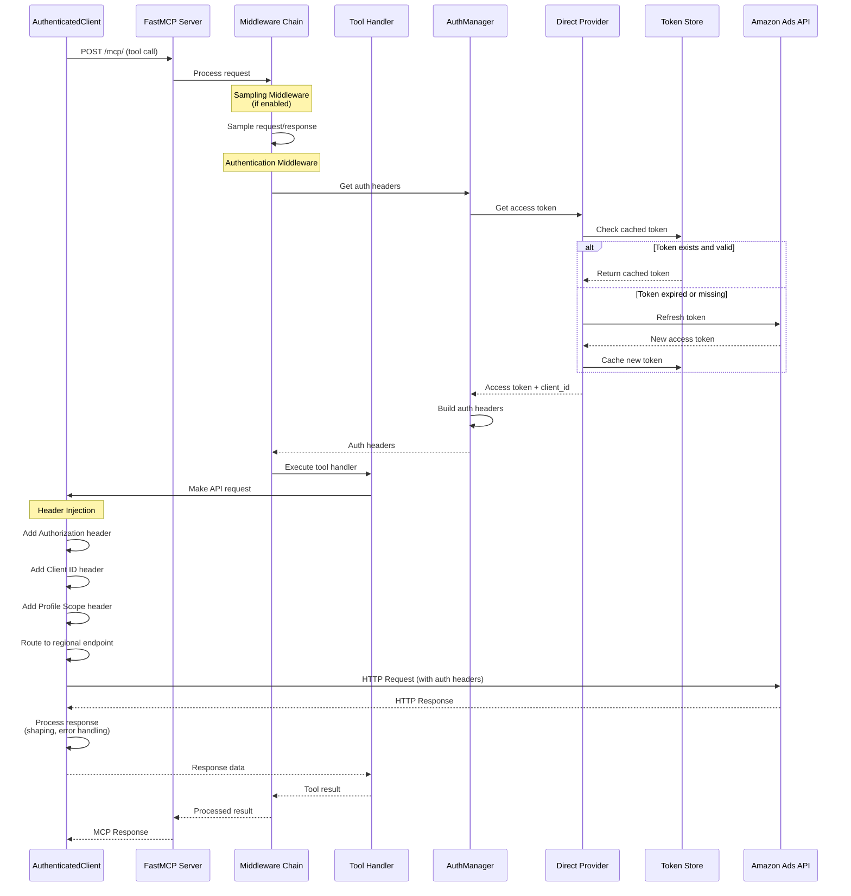
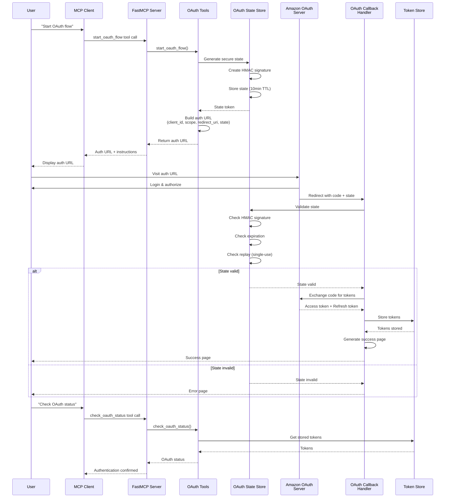
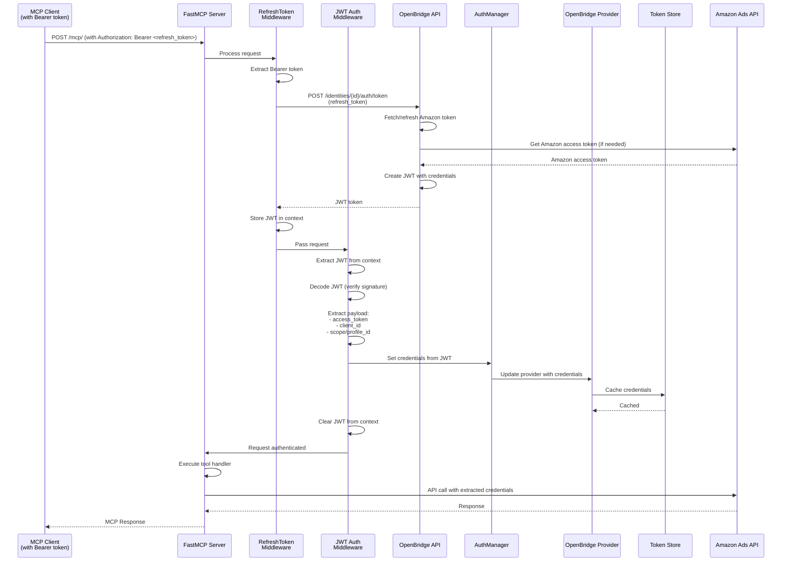
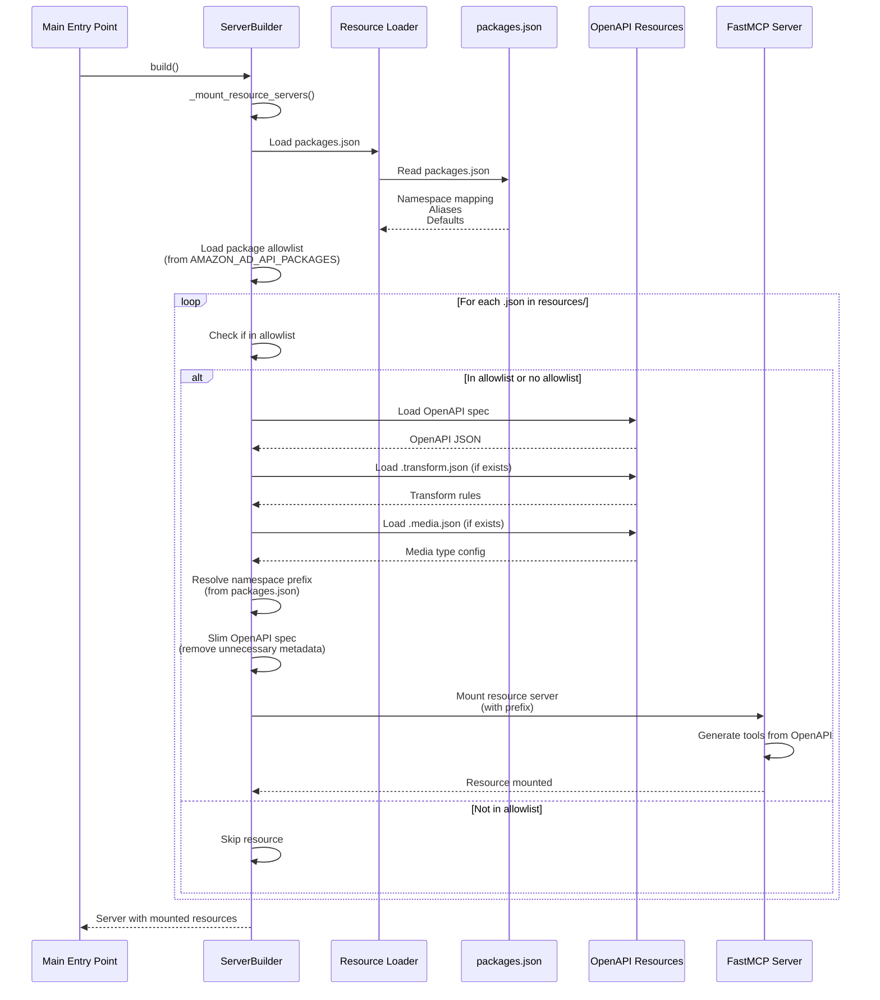
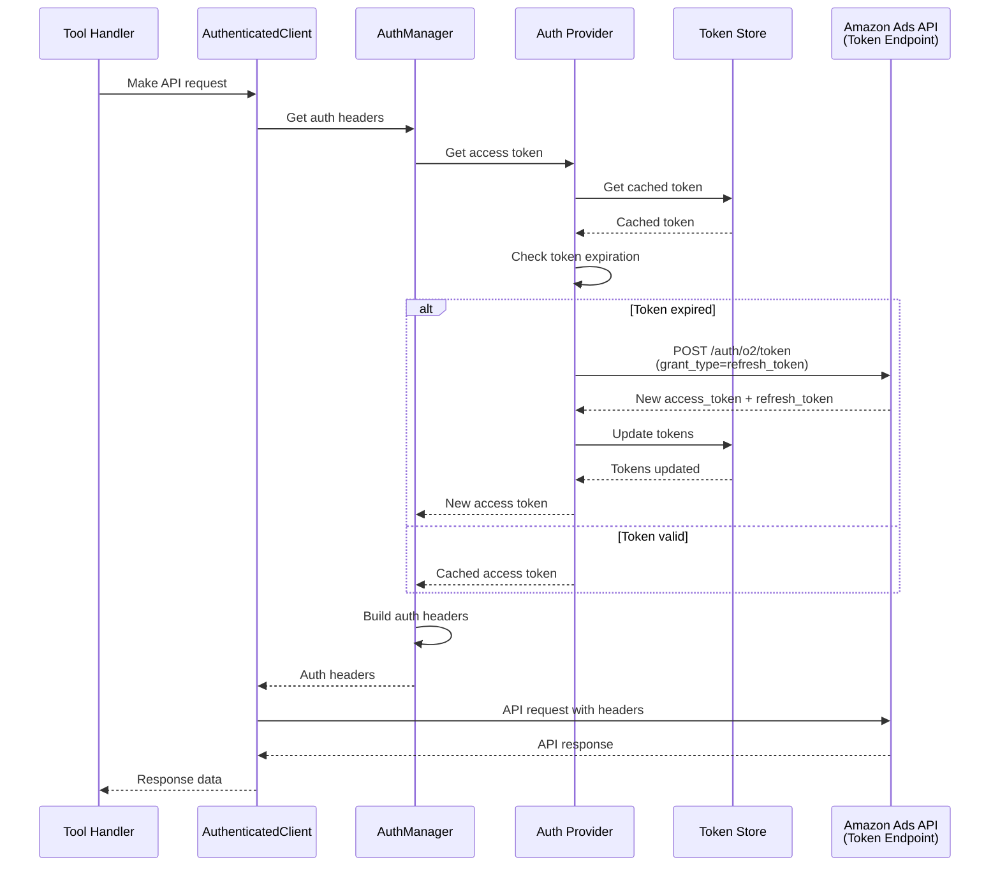
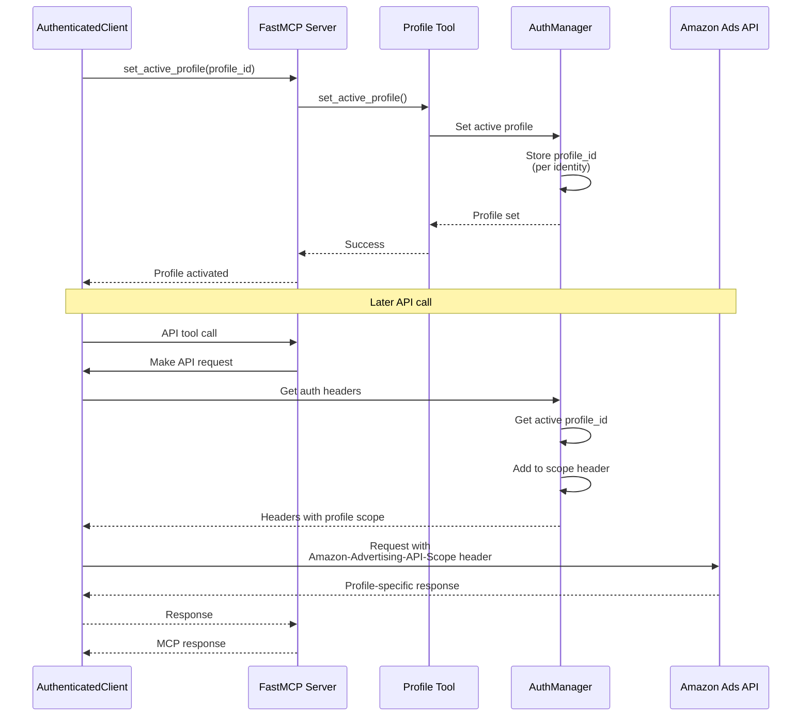
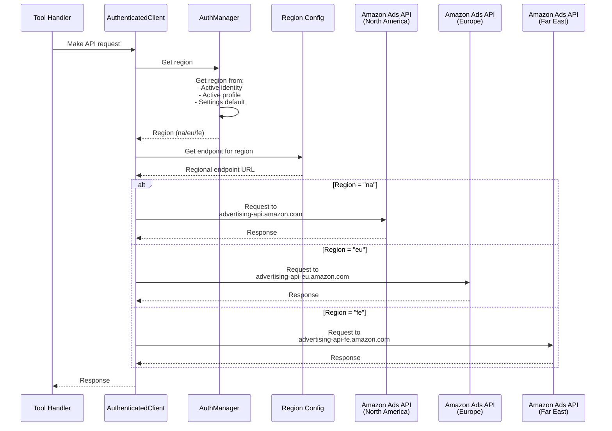
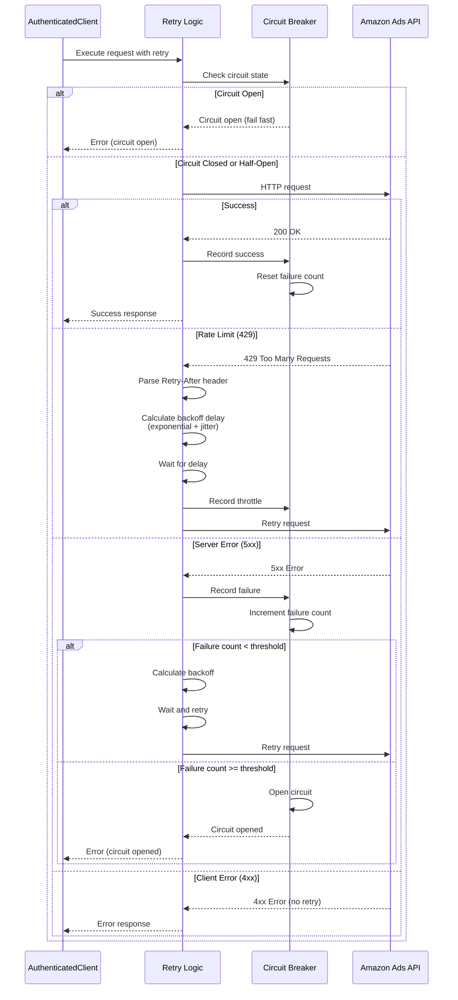
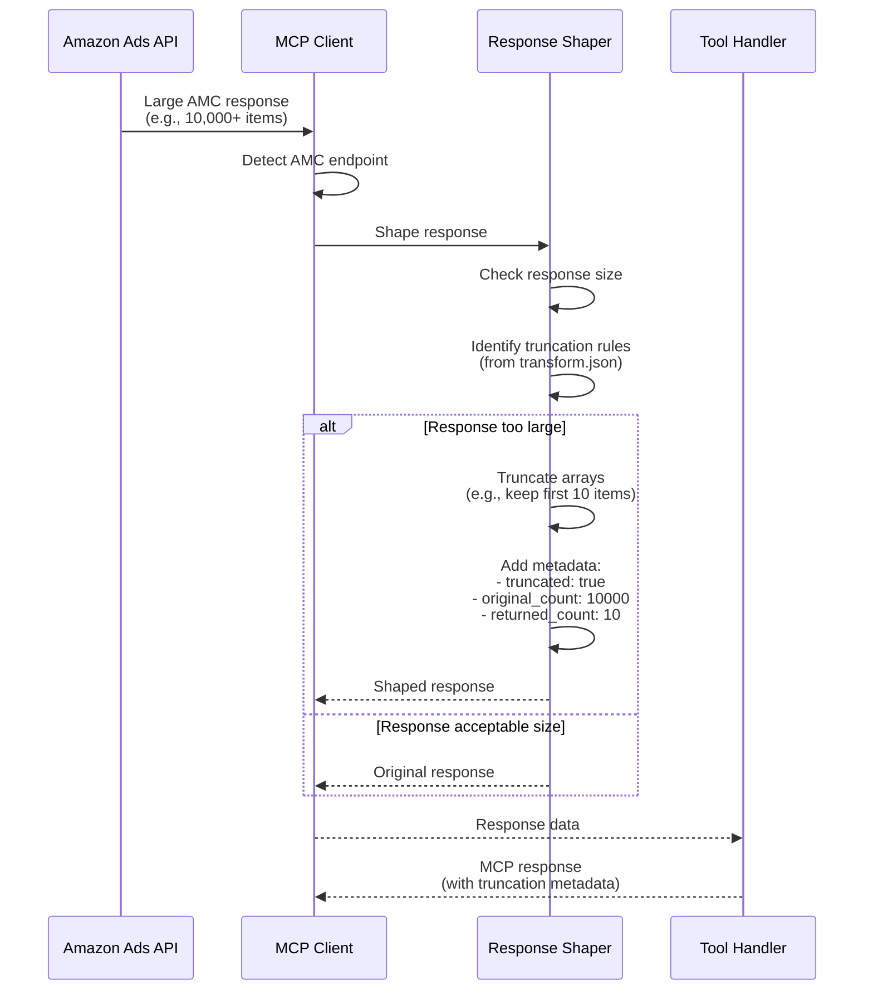
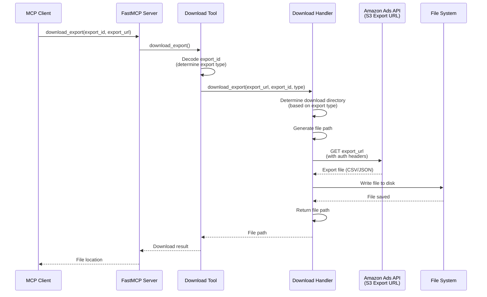

# Amazon Ads MCP Server - Sequence Diagrams

This document contains sequence diagrams illustrating the key call flows in the Amazon Ads MCP Server architecture.

## 1. Tool Call Flow (Direct Auth)

This diagram shows the complete flow when an MCP client calls a tool that requires Amazon Ads API access.



## 2. OAuth Authentication Flow (Direct Auth)

This diagram shows the OAuth 2.0 authorization flow for direct authentication.



## 3. OpenBridge Authentication Flow

This diagram shows the authentication flow when using OpenBridge as a partner application.



## 4. Resource Loading Flow (Server Startup)

This diagram shows how OpenAPI resources are dynamically loaded during server startup.



## 5. Token Refresh Flow

This diagram shows the automatic token refresh mechanism when a token expires.



## 6. Profile Management Flow

This diagram shows how profile ID is managed and used in API calls.



## 7. Regional Routing Flow

This diagram shows how requests are routed to the correct regional endpoint.



## 8. Error Handling and Retry Flow

This diagram shows how errors are handled and retries are performed.



## 9. Response Shaping Flow (AMC Large Responses)

This diagram shows how large AMC responses are automatically truncated.



## 10. Download Export Flow

This diagram shows how exports are downloaded and stored locally.



## ASCII Art Alternative (for non-Mermaid renderers)

### Tool Call Flow (ASCII)

```
┌──────────┐     ┌──────────┐     ┌──────────┐     ┌──────────┐     ┌──────────┐
│   MCP    │────▶│ FastMCP  │────▶│Middleware│────▶│  Tool    │────▶│Authentic.  │
│ Client   │     │  Server  │     │  Chain   │     │ Handler  │     │ Client   │
└──────────┘     └──────────┘     └──────────┘     └──────────┘     └──────────┘
                                                                         │
                                                                         ▼
┌──────────┐     ┌──────────┐     ┌──────────┐     ┌──────────┐     ┌──────────┐
│  Amazon  │◀────│AuthMgr   │◀────│ Provider │◀────│  Token   │     │          │
│ Ads API  │     │          │     │          │     │  Store   │     │          │
└──────────┘     └──────────┘     └──────────┘     └──────────┘     └──────────┘
```

## Notes on Sequence Diagrams

1. **Mermaid Syntax**: These diagrams use Mermaid syntax which can be rendered in:
   - GitHub/GitLab markdown
   - VS Code with Mermaid extension
   - Online Mermaid editors
   - Documentation tools (MkDocs, Docusaurus, etc.)

2. **Component Abbreviations**:
   - `AuthMgr` = AuthManager
   - `MW` = Middleware
   - `MW` = Middleware Chain

3. **Flow Patterns**:
   - **Solid arrows**: Synchronous calls
   - **Dashed arrows**: Async operations or data flow
   - **Alt blocks**: Conditional logic
   - **Notes**: Additional context

4. **Key Interactions**:
   - All flows start from MCP Client or User
   - Authentication is handled transparently by middleware
   - Token refresh happens automatically
   - Error handling includes retries and circuit breakers

